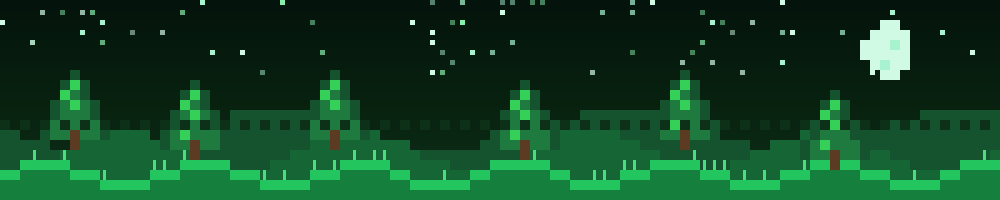

<!--
README Profile for: PiupiuTenshi  (2D PIXEL / RETRO theme)
Cách dùng:
1) Mở repo profile: https://github.com/PiupiuTenshi/PiupiuTenshi
2) Thay nội dung README.md hiện tại bằng toàn bộ nội dung file này.
3) Commit lên nhánh main.

GHI CHÚ VỀ STREAK STATS (mặt buồn "Failed to retrieve contributions"):
- Đó là lỗi rate-limit của SERVER CÔNG CỘNG streak-stats.demolab.com, không phải lỗi của bạn.
- Cách fix triệt để = SELF-HOST (free):
    1) Vào repo: https://github.com/DenverCoder1/github-readme-streak-stats
    2) Bấm nút "Deploy" lên Vercel (làm theo README repo đó).
    3) Tạo Personal Access Token (classic) trên GitHub, gắn vào biến môi trường của Vercel.
    4) Đổi link streak bên dưới từ "streak-stats.demolab.com" -> "ten-cua-ban.vercel.app".
  Sau đó card streak sẽ chạy ổn định, không còn mặt buồn.
-->

<div align="center">

<!-- Banner pixel-art tự vẽ. Upload file pixel-banner.svg vào repo (vd: assets/pixel-banner.svg) rồi giữ đường dẫn này. -->


<!-- PIXEL FONT TITLE (Press Start 2P) - dùng ASCII để font pixel không vỡ chữ -->
<a href="https://github.com/PiupiuTenshi">
  
</a>

<h3>🕹️ Phạm Minh Sáng — Intern Unity Developer 🇻🇳</h3>

<!-- PORTFOLIO CTA -->
<a href="https://the-cursed-biomes-portfolio.onrender.com/">
  
</a>

<br/>


<a href="https://github.com/PiupiuTenshi?tab=followers">
  
</a>


<br/><br/>

<samp>LV.1 INTERN DEV &nbsp; <code>████████████░░░░░░░░</code> &nbsp; 60% → JUNIOR</samp>

</div>

<div align="center">▰▰▰▰▰▰▰▰▰▰▰▰▰▰▰▰▰▰▰▰ ◈ ▰▰▰▰▰▰▰▰▰▰▰▰▰▰▰▰▰▰▰▰</div>

## 👾 whoami


```ts
const sang = {
  name:      "Phạm Minh Sáng",
  alias:     "PiupiuTenshi",
  role:      "Intern Unity Developer",
  location:  "Vietnam 🇻🇳",
  builds:    "2D pixel games 👾",
  focus:     ["Unity", "Gameplay Programming", "C# / .NET"],
  alsoLikes: ["Python automation", "AI tooling", "Web"],
  mindset:   "Build small · Learn fast · Ship often",
  status:    "leveling up, one commit at a time",
};
```

> 🎮 Mình làm **game 2D pixel** với **Unity** — gameplay, game feel & game systems.
> 🧠 Thích kết hợp **AI / automation** với **software engineering** để giải bài toán thực tế.
> 🚀 Hướng đi: thành dev mạnh hơn qua project thật, code sạch, luyện tập đều đặn.

<br clear="right"/>

<div align="center">▰▰▰▰▰▰▰▰▰▰▰▰▰▰▰▰▰▰▰▰ ◈ ▰▰▰▰▰▰▰▰▰▰▰▰▰▰▰▰▰▰▰▰</div>

## 🎒 Inventory — Tech Stack

<div align="center">

`🎮 GAME DEV`
<br/>


`💾 LANGUAGES & WEB`
<br/>


`🛠️ TOOLING`
<br/>


</div>

<div align="center">▰▰▰▰▰▰▰▰▰▰▰▰▰▰▰▰▰▰▰▰ ◈ ▰▰▰▰▰▰▰▰▰▰▰▰▰▰▰▰▰▰▰▰</div>

## 📊 Character Stats

<div align="center">


<!-- STREAK: nếu vẫn hiện mặt buồn -> self-host (xem ghi chú đầu file) rồi đổi domain ở link dưới -->


<br/><br/>


</div>

<div align="center">▰▰▰▰▰▰▰▰▰▰▰▰▰▰▰▰▰▰▰▰ ◈ ▰▰▰▰▰▰▰▰▰▰▰▰▰▰▰▰▰▰▰▰</div>

## 🗺️ Quest Log — Currently Leveling Up

<table>
  <tr>
    <td width="50%" valign="top">

**🎮 UNITY / 2D PIXEL**
- [x] Gameplay loop & game feel
- [x] 2D physics & collisions
- [x] Animation Controller
- [ ] Pixel-perfect camera & lighting
- [ ] Tilemap / level design
- [ ] ScriptableObject architecture
- [ ] Save / load system
- [ ] Object pooling

  </td>
  <td width="50%" valign="top">

**🧠 SOFTWARE ENGINEERING**
- [x] Clean C# code
- [x] Git workflow
- [ ] SOLID & game design patterns
- [ ] REST API integration
- [ ] Database basics
- [ ] Testing mindset
- [ ] CI/CD basics
- [ ] Portfolio polish

  </td>
  </tr>
</table>

<div align="center">▰▰▰▰▰▰▰▰▰▰▰▰▰▰▰▰▰▰▰▰ ◈ ▰▰▰▰▰▰▰▰▰▰▰▰▰▰▰▰▰▰▰▰</div>

## 🐍 Contribution Snake & Quote

<div align="center">

<!--
Con rắn sẽ hiện sau khi workflow .github/workflows/snake.yml chạy lần đầu (push lên main hoặc bấm Run trong tab Actions).
Nó tạo file SVG ở nhánh "output". Nếu chưa thấy rắn -> vào tab Actions xem workflow đã chạy xong chưa.
-->


<br/><br/>


</div>

<div align="center">▰▰▰▰▰▰▰▰▰▰▰▰▰▰▰▰▰▰▰▰ ◈ ▰▰▰▰▰▰▰▰▰▰▰▰▰▰▰▰▰▰▰▰</div>

## 🤝 Connect — Continue?

<div align="center">

<a href="https://the-cursed-biomes-portfolio.onrender.com/">
  
</a>
<a href="https://github.com/PiupiuTenshi">
  
</a>

<br/><br/>

<samp>⌨ GAME OVER? &nbsp;|&nbsp; INSERT COIN TO CONTINUE 🪙</samp>


</div>